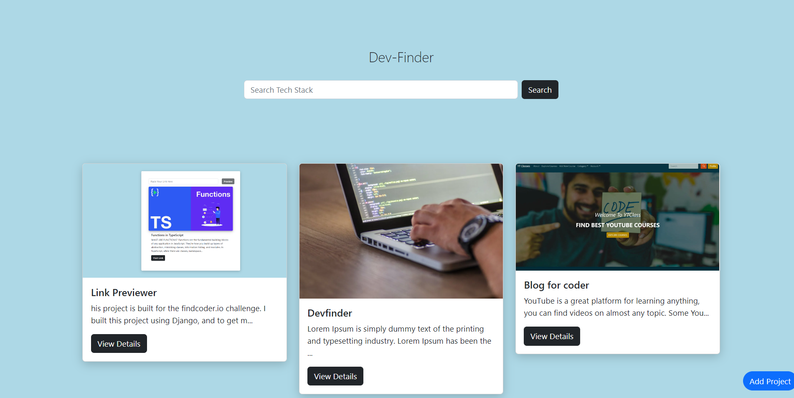
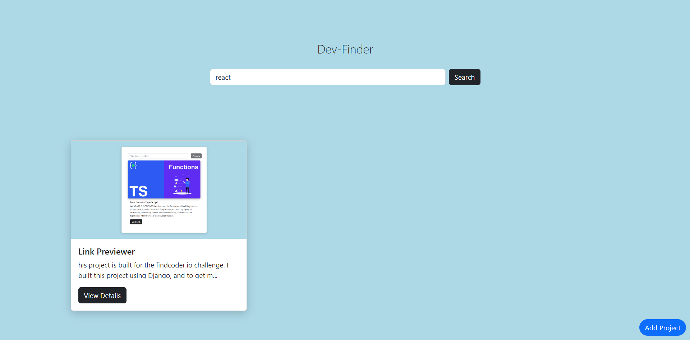
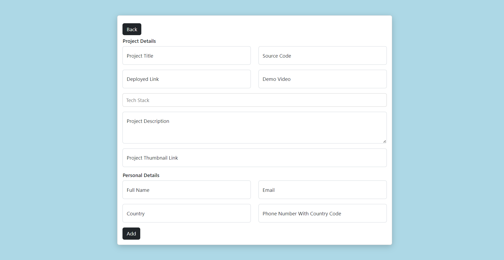

The idea behind this project is that Developers can add projects they worked on and their details. The hiring manager can search for developers based on the tech stack they will search of tech-stack and see projects made on that tech stack and find developers.

For making this project I have used fast API in the backend, Harperdb for the database, and React in the frontend

this is the home page of the site.

screenshot of search feature

screenshot of developer adding projects and contact details

screenshot of project details page

Thanks
